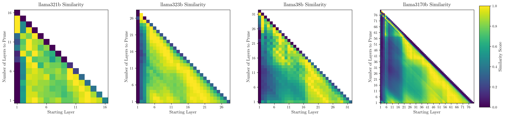
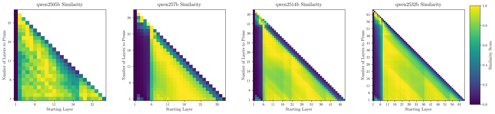
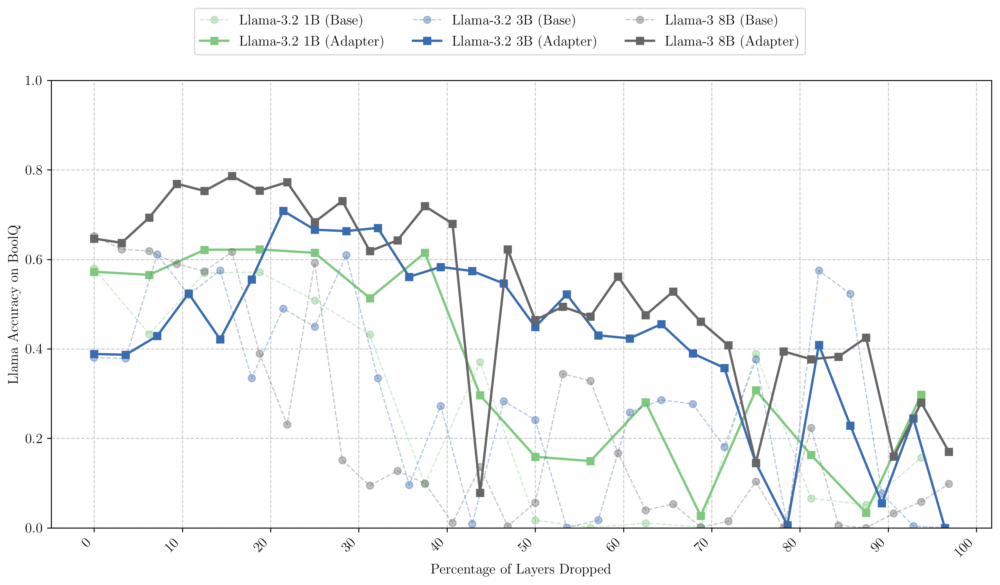
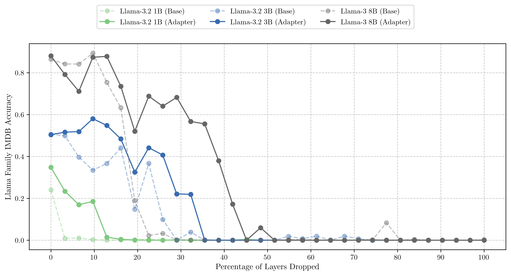
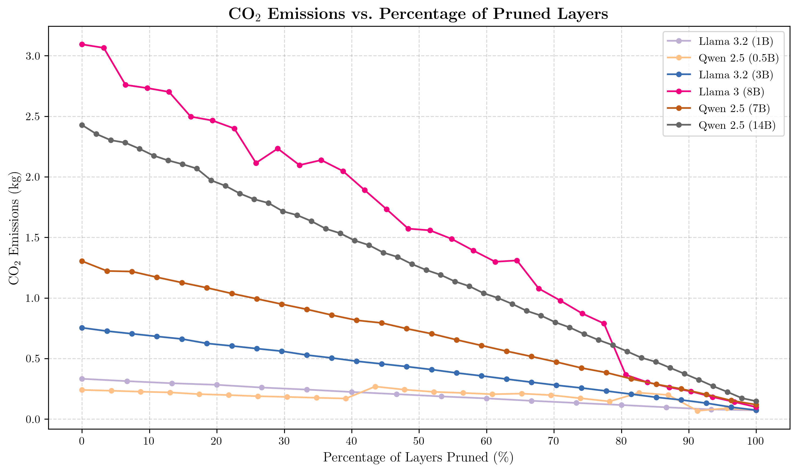
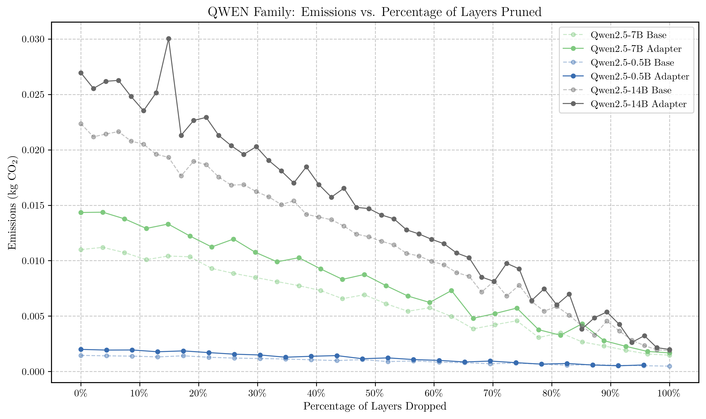

# LLM-Pruning: A Novel Post-Training Optimization Approach

## Overview
Large Language Models (LLMs) have revolutionized natural language processing, but their substantial computational and energy requirements pose significant challenges for sustainable deployment. While much attention has focused on reducing pretraining costs, the majority of a model's environmental impact occurs during inference—its primary operational mode. This creates an urgent need for optimization strategies that can reduce the ecological footprint of LLMs while maintaining their performance.
Our research introduces a novel post-training pruning methodology that:

* Strategically identifies optimal pruning points through neighborhood similarity analysis
* Systematically removes architectural elements while preserving model functionality
* Quantifies both performance impact and resource efficiency gains

The implementation includes comprehensive evaluation across multiple NLP tasks (question answering, sentiment analysis, summarization) to validate our approach. By focusing on post-deployment optimization, we directly address the environmental challenges of AI technologies, contributing to more sustainable large language model deployments.

## Authors
This work was conducted as an undergraduate thesis project by:
- **Paul Lambert** (Undergraduate Researcher)
- **Julia Hockenmaier, PhD** (Professor, Research Adviser)

*Department of Computer Science, University of Illinois at Urbana-Champaign*

## Table of Contents
- [Installation](#installation)
- [Usage](#usage)
- [Project Structure](#project-structure)
- [Experimental Results](#experimental-results)
- [Contributing](#contributing)
- [License](#license)

## Installation

This project uses conda for environment management. To set up:

```bash
# Clone the repository
git clone git@github.com:hipml/llm-pruning-thesis.git 
cd llm-pruning-thesis

# Create and activate conda environment
conda env create -f environment.yml
conda activate [env-name]
```

## Usage

### Source Code Components

1. `[1-gpu-collector.py]`: Multi-GPU script for capturing all layer hidden state tensors for a given model
2. `[2-meantensor.py]`: Processing mean tensors to find optimal pruning start points
3. `[multitrain.py]`: Multi-GPU QLoRA training script to optimally prune a model's layers of block size `n` and then heal it with an adapter trained on the `allenai/c4` dataset
4. `[eval.py]`: Evaluate the pruned (and healed) models on:
   * Question/Answering (`BoolQ`), 
   * Sentiment Analysis (`IMDB`), 
   * Summarization (`xsum`), and 
   * Perplexity measurements

### Running on HPC Cluster

For high-performance computing cluster execution, refer to the SLURM job scripts in the `batch/` directory:

```bash
# Example SLURM job submission
sbatch batch/multitrain.sh llama3170b boolq
```

## Project Structure

```
.
├── docs/                  # Additional documentation + Paper
├── batch/                 # SLURM batch scripts
├── models/                # Emissions data from QLoRA training
├── output/                # Generated outputs
│   └── viz/               # Visualization outputs
└── src/                   # Source code files
    └── support/           # Helper classes and config files

```

## Experimental Results

### Key Findings








### Raw Results

Experimental results are organized as follows: 

1. Task evaluation results: 

```
output/evaluation_results
```

2. Environmental impact data: 
```
models/adapters/<model_name>/<pruned_layers>/emissions.csv
```

## Contributing

While this project has reached its conclusion, we'd love to hear from anybody interested. Please feel free to contact the author or to submit a Pull Request.

## License

This project is licensed under the University of Illinois/NCSA Open Source License - see the [LICENSE.txt](LICENSE.txt) file for details.

---

## Citation

If you use this code in your research, please cite:

```bibtex
@thesis{lambert2024llmpruning,
    author = {Lambert, Paul},
    title = {Post-Training Optimizations in Large Language Models: A Novel Pruning Approach},
    school = {University of Illinois at Urbana-Champaign},
    year = {2024},
    type = {Bachelor's Thesis},
    advisor = {Hockenmaier, Julia}
}
```
